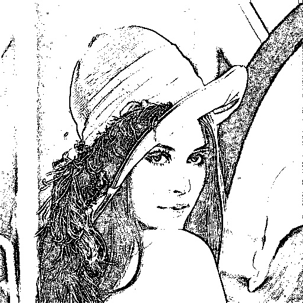
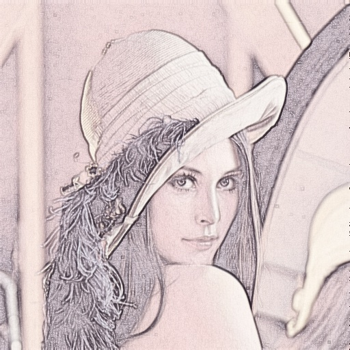

# sketch-filter

Implementation methods purposed from the paper **Sketch filter for feature extraction and rendering applications**

# How to build

```
$ git clone https://github.com/Jim00000/sketch-filter
$ cd sketch-filter
$ mkdir build
$ cd build
$ cmake ..  # or use cmake-gui ..
$ make
```

and then both programs are inside build/bin/ folder

# Usage

sketch-filter-edge image-name [output-image-name(default : output.jpg) [threshold(default : 180) [alpha(default : 5) ]]]

sketch-filter-ani image-name [output-image-name(default : output.jpg) [alpha(default : 5) [beta(default : 0.75)] ]]]

# Demo

`$ sketch-filter-edge Lenna.png output1.jpg 220 3`



`$ sketch-filter-ani Lenna.png output2.jpg 5 0.8`



# References

- [Sketch filter for feature extraction and rendering applications](http://ieeexplore.ieee.org/document/6553028/)